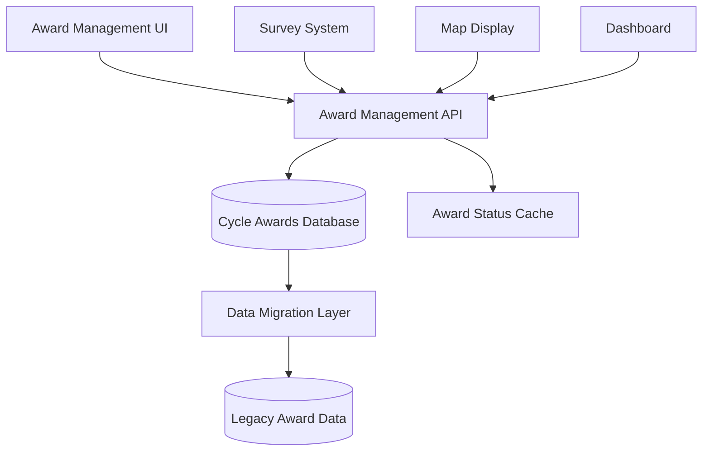

# Cycle-Aware Award Management - Design Document

## Overview

The Cycle-Aware Award Management system implements a comprehensive solution for managing SGLGB awards on a per-cycle basis. The design focuses on data integrity, user experience, and system performance while maintaining backward compatibility with existing survey operations.

## Architecture

### High-Level Architecture



### Data Flow

1. **Award Assignment Flow**: Admin UI → API → Database → Cache Update → UI Refresh
2. **Survey Target Flow**: Survey System → API → Filter Awardees → Generate Targets
3. **Map Display Flow**: Map Component → API → Award Status → Color Mapping
4. **Cycle Transition Flow**: Cycle Change → Preserve Current → Load Target Cycle → Update UI

## Components and Interfaces

### Database Layer

#### Cycle Awards Table Schema

```sql
CREATE TABLE cycle_awards (
    id SERIAL PRIMARY KEY,
    barangay_id INTEGER NOT NULL REFERENCES barangays(id),
    cycle_id INTEGER NOT NULL REFERENCES survey_cycles(id),
    is_awardee BOOLEAN NOT NULL DEFAULT false,
    awarded_date TIMESTAMP,
    notes TEXT,
    created_at TIMESTAMP DEFAULT CURRENT_TIMESTAMP,
    updated_at TIMESTAMP DEFAULT CURRENT_TIMESTAMP,
    created_by INTEGER REFERENCES users(id),
    
    UNIQUE(barangay_id, cycle_id)
);

CREATE INDEX idx_cycle_awards_cycle ON cycle_awards(cycle_id);
CREATE INDEX idx_cycle_awards_barangay ON cycle_awards(barangay_id);
CREATE INDEX idx_cycle_awards_status ON cycle_awards(is_awardee);
```

#### Database Helper Functions

```typescript
interface CycleAwardService {
  getAwardsForCycle(cycleId: number): Promise<CycleAward[]>
  setAwardStatus(barangayId: number, cycleId: number, isAwardee: boolean): Promise<void>
  bulkSetAwards(awards: BulkAwardUpdate[]): Promise<void>
  getAwardHistory(barangayId: number): Promise<CycleAward[]>
  migrateExistingAwards(): Promise<void>
}
```

### API Layer

#### Award Management Endpoints

```typescript
// GET /api/cycle-awards?cycle_id={id}
interface GetCycleAwardsResponse {
  awards: CycleAward[]
  totalBarangays: number
  awardeeCount: number
}

// POST /api/cycle-awards
interface CreateAwardRequest {
  barangayId: number
  cycleId: number
  isAwardee: boolean
  notes?: string
}

// PUT /api/cycle-awards/{id}
interface UpdateAwardRequest {
  isAwardee: boolean
  notes?: string
}

// POST /api/cycle-awards/bulk
interface BulkAwardRequest {
  cycleId: number
  awards: Array<{
    barangayId: number
    isAwardee: boolean
  }>
}
```

#### Enhanced Barangay Endpoints

```typescript
// GET /api/barangays?cycle_id={id}&include_awards=true
interface BarangayWithAwards extends Barangay {
  awardStatus?: {
    isAwardee: boolean
    awardedDate?: string
    notes?: string
  }
}
```

### UI Components

#### Award Management Settings Page

```typescript
interface AwardManagementProps {
  activeCycle: SurveCycle
  barangays: BarangayWithAwards[]
  onAwardChange: (barangayId: number, isAwardee: boolean) => void
  onBulkUpdate: (updates: BulkAwardUpdate[]) => void
}

interface AwardStatusDropdown {
  barangayId: number
  currentStatus: boolean
  onChange: (isAwardee: boolean) => void
  disabled?: boolean
}
```

#### Map Integration

```typescript
interface MapColoringService {
  getBarangayColor(barangay: Barangay, cycleId: number): string
  updateMapLegend(cycleId: number): void
}

const AWARD_COLORS = {
  AWARDEE: '#22c55e',      // Green
  NON_AWARDEE: '#6b7280'   // Gray
} as const
```

## Data Models

### Core Models

```typescript
interface CycleAward {
  id: number
  barangayId: number
  cycleId: number
  isAwardee: boolean
  awardedDate?: Date
  notes?: string
  createdAt: Date
  updatedAt: Date
  createdBy?: number
}

interface BulkAwardUpdate {
  barangayId: number
  isAwardee: boolean
  notes?: string
}

interface AwardHistory {
  cycleId: number
  cycleName: string
  isAwardee: boolean
  awardedDate?: Date
  notes?: string
}
```

### Survey Integration Models

```typescript
interface CycleAwareSurveyTarget extends SurveyTarget {
  awardStatus: {
    isAwardee: boolean
    verifiedAt: Date
  }
}

interface FilteredBarangayList {
  awardees: Barangay[]
  nonAwardees: Barangay[]
  totalCount: number
  awardeeCount: number
}
```

## Error Handling

### Database Error Handling

```typescript
class AwardManagementError extends Error {
  constructor(
    message: string,
    public code: 'CYCLE_NOT_FOUND' | 'BARANGAY_NOT_FOUND' | 'DUPLICATE_AWARD' | 'INTEGRITY_VIOLATION',
    public details?: any
  ) {
    super(message)
  }
}

const errorHandlers = {
  handleDuplicateAward: (error: any) => {
    throw new AwardManagementError(
      'Award already exists for this barangay and cycle',
      'DUPLICATE_AWARD',
      error
    )
  },
  
  handleIntegrityViolation: (error: any) => {
    throw new AwardManagementError(
      'Data integrity violation detected',
      'INTEGRITY_VIOLATION',
      error
    )
  }
}
```

### API Error Responses

```typescript
interface ErrorResponse {
  error: string
  code: string
  details?: any
  timestamp: string
}

const handleApiError = (error: AwardManagementError): ErrorResponse => ({
  error: error.message,
  code: error.code,
  details: error.details,
  timestamp: new Date().toISOString()
})
```

## Testing Strategy

### Unit Testing Approach

1. **Database Layer Tests**
   - Test CRUD operations for cycle awards
   - Verify foreign key constraints
   - Test bulk operations and transactions
   - Validate data migration logic

2. **API Layer Tests**
   - Test all endpoint responses and error cases
   - Verify authentication and authorization
   - Test bulk operations and validation
   - Mock database interactions

3. **UI Component Tests**
   - Test award status dropdown functionality
   - Verify bulk selection and operations
   - Test import/export functionality
   - Mock API calls and responses

### Integration Testing Approach

1. **End-to-End Award Management**
   - Test complete award assignment workflow
   - Verify cycle transitions preserve data
   - Test bulk operations with real data
   - Validate map coloring updates

2. **Survey System Integration**
   - Test survey target filtering with awards
   - Verify assignment creation for awardees only
   - Test dashboard filtering accuracy
   - Validate analytics calculations

3. **Data Migration Testing**
   - Test migration from legacy award system
   - Verify data integrity after migration
   - Test rollback procedures
   - Validate performance with large datasets

### Performance Testing

1. **Database Performance**
   - Test query performance with large datasets
   - Verify index effectiveness
   - Test bulk operation performance
   - Monitor memory usage during migrations

2. **API Performance**
   - Test response times for award endpoints
   - Verify caching effectiveness
   - Test concurrent user scenarios
   - Monitor resource utilization

## Security Considerations

### Access Control

```typescript
interface AwardPermissions {
  canViewAwards: boolean
  canManageAwards: boolean
  canBulkUpdateAwards: boolean
  canViewHistory: boolean
}

const checkAwardPermissions = (user: User, action: string): boolean => {
  const permissions = getUserPermissions(user)
  return permissions.includes(`award:${action}`)
}
```

### Data Validation

```typescript
const validateAwardUpdate = (update: BulkAwardUpdate): ValidationResult => {
  const errors: string[] = []
  
  if (!update.barangayId || update.barangayId <= 0) {
    errors.push('Invalid barangay ID')
  }
  
  if (typeof update.isAwardee !== 'boolean') {
    errors.push('Award status must be boolean')
  }
  
  return { isValid: errors.length === 0, errors }
}
```

## Migration Strategy

### Data Migration Plan

1. **Phase 1: Schema Creation**
   - Create cycle_awards table
   - Add necessary indexes
   - Set up foreign key constraints

2. **Phase 2: Data Migration**
   - Migrate existing seal data to cycle-specific awards
   - Validate migrated data integrity
   - Create backup of original data

3. **Phase 3: System Integration**
   - Update existing APIs to use new schema
   - Modify UI components for cycle awareness
   - Update map coloring logic

4. **Phase 4: Cleanup**
   - Remove deprecated award fields
   - Update documentation
   - Monitor system performance

### Rollback Strategy

```typescript
interface MigrationRollback {
  backupOriginalData(): Promise<void>
  validateMigration(): Promise<boolean>
  rollbackIfNeeded(): Promise<void>
  cleanupTempData(): Promise<void>
}
```

## Performance Optimizations

### Caching Strategy

```typescript
interface AwardCache {
  getCachedAwards(cycleId: number): Promise<CycleAward[] | null>
  setCachedAwards(cycleId: number, awards: CycleAward[]): Promise<void>
  invalidateCache(cycleId?: number): Promise<void>
}

const CACHE_TTL = 300 // 5 minutes
const CACHE_KEY_PREFIX = 'cycle_awards:'
```

### Database Optimizations

1. **Indexing Strategy**
   - Composite index on (cycle_id, is_awardee)
   - Index on barangay_id for joins
   - Partial index on active awards only

2. **Query Optimization**
   - Use prepared statements for bulk operations
   - Implement connection pooling
   - Optimize JOIN queries with proper indexes

## Monitoring and Logging

### Key Metrics

```typescript
interface AwardMetrics {
  awardAssignmentRate: number
  bulkOperationPerformance: number
  cacheHitRate: number
  apiResponseTimes: number[]
  errorRates: Record<string, number>
}
```

### Logging Strategy

```typescript
const logAwardChange = (
  userId: number,
  barangayId: number,
  cycleId: number,
  oldStatus: boolean,
  newStatus: boolean
) => {
  logger.info('Award status changed', {
    userId,
    barangayId,
    cycleId,
    oldStatus,
    newStatus,
    timestamp: new Date().toISOString()
  })
}
```