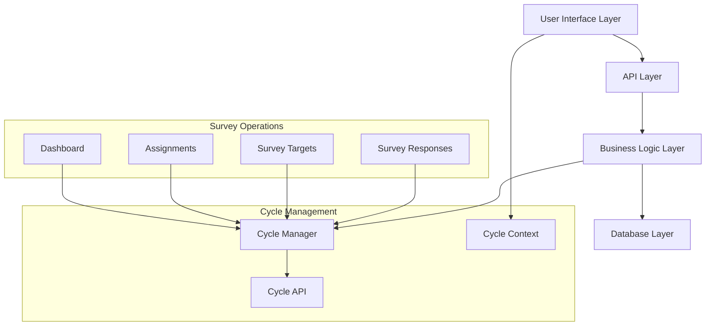
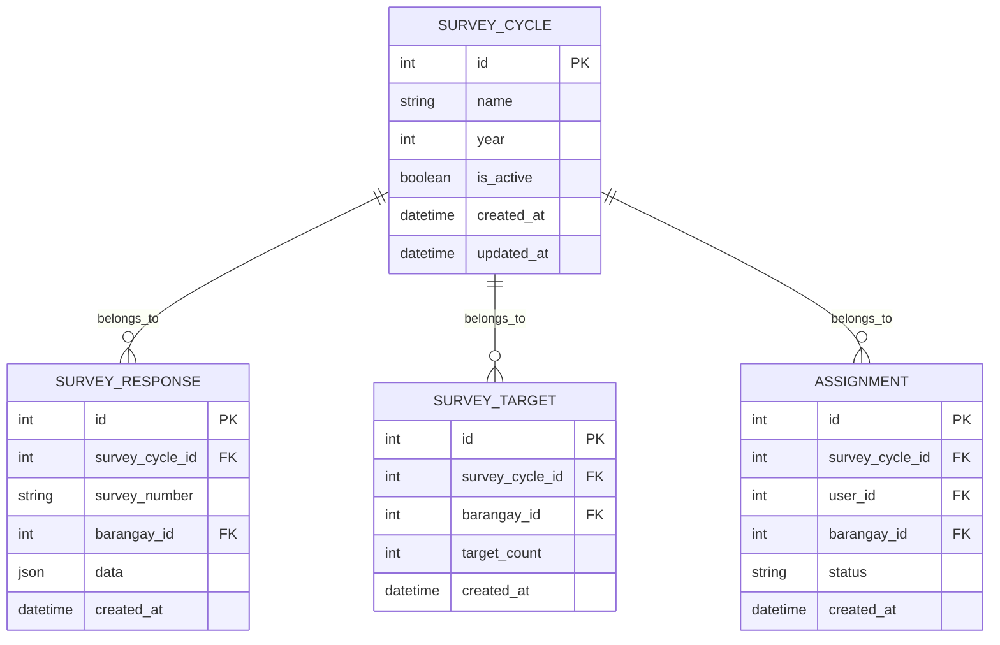

# Design Document

## Overview

The Survey Cycle Integration feature transforms the existing survey system architecture to support proper cycle-based data isolation and management. The design implements a centralized active cycle management system with database-level constraints and API-level enforcement to ensure all survey operations are properly scoped.

## Architecture

### High-Level Architecture



### Database Architecture

The design implements cycle awareness through foreign key relationships and constraints:



## Components and Interfaces

### 1. Active Survey Cycle Manager

**Purpose:** Central component for managing active survey cycle state and operations.

**Key Methods:**
- `getActiveCycle(): Promise<SurveyCycle | null>`
- `setActiveCycle(cycleId: number): Promise<void>`
- `validateSingleActiveCycle(): Promise<boolean>`

**Implementation Location:** `src/utils/surveyCycleHelpers.ts`

### 2. Survey Cycle API Endpoints

**Base Path:** `/api/survey-cycles/`

**Endpoints:**
- `GET /active` - Retrieve currently active cycle
- `POST /active` - Set a cycle as active (admin only)
- `GET /` - List all cycles (with historical data)
- `GET /:id` - Get specific cycle details

**Response Format:**
```typescript
interface SurveyCycle {
  id: number;
  name: string;
  year: number;
  is_active: boolean;
  created_at: string;
  updated_at: string;
}
```

### 3. Survey Cycle Context Provider

**Purpose:** React context for managing cycle state across the application.

**Context Interface:**
```typescript
interface SurveyCycleContextType {
  activeCycle: SurveyCycle | null;
  loading: boolean;
  error: string | null;
  refreshActiveCycle: () => Promise<void>;
  setActiveCycle: (cycleId: number) => Promise<void>;
}
```

**Implementation:** `src/contexts/SurveyCycleContext.tsx`

### 4. Cycle-Aware Data Services

**Survey Response Service:**
- Automatically link responses to active cycle
- Update survey number format: `BB-CYCLEYEAR-NNNN`
- Filter queries by active cycle

**Dashboard Service:**
- Filter all analytics by active cycle
- Reset progress calculations for new cycles
- Provide cycle-scoped funnel analysis

**Assignment Service:**
- Link assignments to active cycle
- Filter assignment views by cycle
- Update auto-completion logic

## Data Models

### Enhanced Survey Response Model

```typescript
interface SurveyResponse {
  id: number;
  survey_cycle_id: number; // NEW: Foreign key to survey cycle
  survey_number: string; // FORMAT: BB-CYCLEYEAR-NNNN
  barangay_id: number;
  interviewer_id: number;
  data: SurveyData;
  created_at: string;
  updated_at: string;
  
  // Relations
  survey_cycle?: SurveyCycle;
  barangay?: Barangay;
  interviewer?: User;
}
```

### Enhanced Survey Target Model

```typescript
interface SurveyTarget {
  id: number;
  survey_cycle_id: number; // NEW: Foreign key to survey cycle
  barangay_id: number;
  target_count: number;
  achieved_count: number;
  created_at: string;
  updated_at: string;
  
  // Relations
  survey_cycle?: SurveyCycle;
  barangay?: Barangay;
}
```

### Enhanced Assignment Model

```typescript
interface Assignment {
  id: number;
  survey_cycle_id: number; // NEW: Foreign key to survey cycle
  user_id: number;
  barangay_id: number;
  status: AssignmentStatus;
  assigned_at: string;
  completed_at?: string;
  
  // Relations
  survey_cycle?: SurveyCycle;
  user?: User;
  barangay?: Barangay;
}
```

## Error Handling

### Database Constraint Violations

**Multiple Active Cycles:**
- Database constraint prevents multiple `is_active = true` records
- API returns `409 Conflict` with clear error message
- UI displays user-friendly error notification

**Missing Active Cycle:**
- Operations requiring active cycle check for null/undefined
- Graceful degradation with appropriate user messaging
- Admin notification for cycle setup requirement

**Foreign Key Violations:**
- Validate cycle existence before creating related records
- Return `400 Bad Request` for invalid cycle references
- Log constraint violations for debugging

### API Error Responses

```typescript
interface ApiError {
  error: string;
  message: string;
  code: string;
  details?: any;
}

// Example responses:
// 409 - Multiple active cycles detected
// 404 - No active cycle found
// 400 - Invalid cycle ID provided
// 403 - Insufficient permissions for cycle management
```

## Testing Strategy

### Unit Testing

**Survey Cycle Manager:**
- Test active cycle retrieval
- Test cycle activation/deactivation
- Test constraint validation
- Mock database interactions

**API Endpoints:**
- Test all CRUD operations
- Test error conditions
- Test authorization requirements
- Validate response formats

**Context Provider:**
- Test state management
- Test error handling
- Test refresh mechanisms
- Mock API calls

### Integration Testing

**Database Integration:**
- Test foreign key constraints
- Test unique constraint on active cycles
- Test cascade operations
- Verify data isolation

**API Integration:**
- Test end-to-end cycle management
- Test survey operations with cycles
- Test dashboard data filtering
- Verify cross-component interactions

**UI Integration:**
- Test cycle selector functionality
- Test context propagation
- Test automatic data refresh
- Verify user experience flows

### End-to-End Testing

**Complete Cycle Workflow:**
1. Create new survey cycle
2. Set as active cycle
3. Generate survey data
4. Verify data isolation
5. Switch to different cycle
6. Verify historical data access

**Data Migration Testing:**
- Test existing data assignment to cycles
- Verify backward compatibility
- Test rollback scenarios
- Validate data integrity

## Performance Considerations

### Database Optimization

**Indexing Strategy:**
- Index on `survey_cycle_id` for all related tables
- Composite index on `(survey_cycle_id, barangay_id)` for common queries
- Index on `is_active` for quick active cycle lookup

**Query Optimization:**
- Use prepared statements for cycle-filtered queries
- Implement query result caching for active cycle
- Optimize dashboard aggregation queries

### Caching Strategy

**Active Cycle Caching:**
- Cache active cycle in memory with TTL
- Invalidate cache on cycle changes
- Use Redis for distributed caching if needed

**Dashboard Data Caching:**
- Cache cycle-specific dashboard data
- Implement cache invalidation on data updates
- Use appropriate cache keys with cycle ID

## Security Considerations

### Authorization

**Cycle Management:**
- Restrict cycle activation to admin users only
- Implement role-based access control
- Log all cycle management operations

**Data Access:**
- Ensure users can only access authorized cycle data
- Implement proper session management
- Validate cycle permissions on API calls

### Data Integrity

**Audit Trail:**
- Log all cycle state changes
- Track data modifications with cycle context
- Implement change history for cycles

**Backup Strategy:**
- Backup before major cycle operations
- Implement point-in-time recovery
- Test restoration procedures

## Migration Strategy

### Phase 1: Database Schema Updates
1. Add new columns with nullable constraints
2. Create foreign key relationships
3. Add unique constraint on active cycles
4. Update existing data with default cycle

### Phase 2: API Implementation
1. Implement cycle management endpoints
2. Update existing APIs to be cycle-aware
3. Add cycle filtering to all queries
4. Implement error handling

### Phase 3: UI Integration
1. Add cycle context provider
2. Implement cycle selector component
3. Update all components to use cycle context
4. Add cycle indicators to navigation

### Phase 4: Testing and Rollout
1. Comprehensive testing of all features
2. Performance testing with multiple cycles
3. User acceptance testing
4. Gradual rollout with feature flags