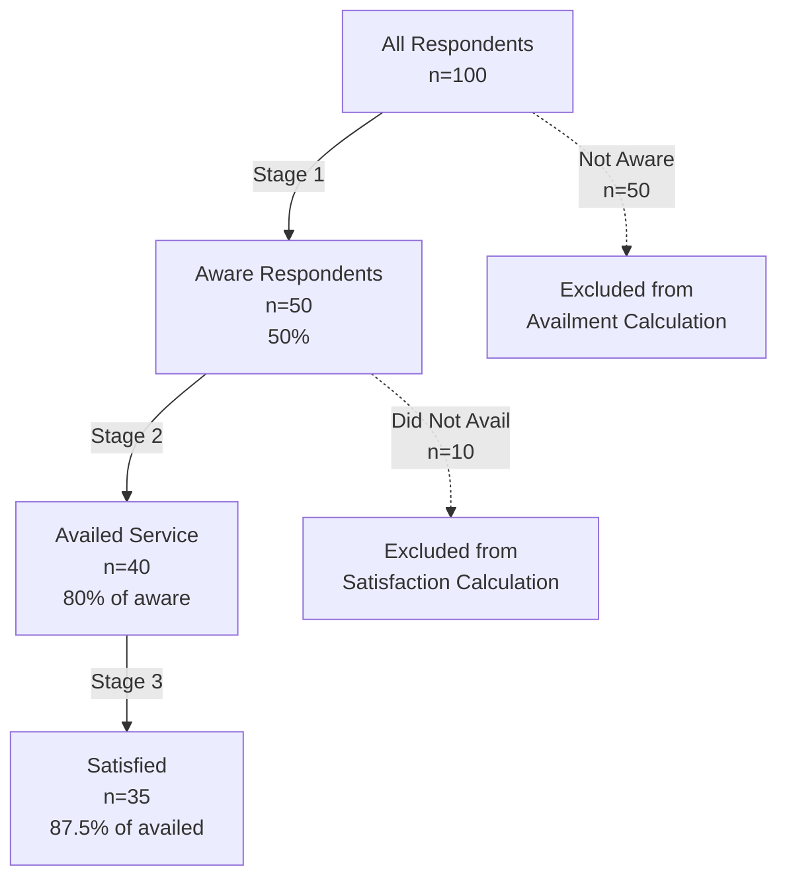

# Funnel Calculation Methodology

## Introduction

This document describes the cascading funnel approach used to calculate service delivery metrics in the SIGLA analytics system. The funnel methodology ensures that awareness, availment, and satisfaction metrics accurately reflect the sequential nature of service delivery, where each stage depends on the previous stage.

The cascading funnel approach models the real-world progression of service delivery:
1. **Awareness**: Residents must first know about a service
2. **Availment**: Only aware residents can avail/use the service
3. **Satisfaction**: Only residents who availed can rate their satisfaction

This methodology replaced the previous independent calculation approach in [deployment date] to provide more accurate and meaningful analytics.

## The Problem with Independent Calculations

### Old Methodology (Incorrect)

The previous system calculated all three metrics independently using the total number of respondents as the denominator for each calculation:

```
Awareness % = (Aware respondents / Total respondents) × 100
Availment % = (Availed respondents / Total respondents) × 100
Satisfaction % = (Satisfied respondents / Total respondents) × 100
```

**Why This Was Wrong:**

1. **Logical Inconsistency**: It's impossible to avail a service you're unaware of, yet the calculation treated these as independent events
2. **Misleading Percentages**: Availment and satisfaction percentages were artificially deflated by including respondents who couldn't possibly have used the service
3. **Hidden Drop-offs**: The methodology obscured where residents were dropping out of the service delivery funnel
4. **Incorrect Comparisons**: Comparing availment rates across services was meaningless when denominators included unaware residents

### Example of the Problem

Consider a service with 100 respondents:
- 50 are aware of the service
- 40 of those aware residents availed the service
- 35 of those who availed were satisfied

**Old (Incorrect) Calculation:**
```
Awareness: 50/100 = 50%
Availment: 40/100 = 40%
Satisfaction: 35/100 = 35%
```

This suggests only 40% availment, but this includes 50 people who didn't even know about the service!

**New (Correct) Calculation:**
```
Awareness: 50/100 = 50%
Availment: 40/50 = 80%  (80% of aware residents availed)
Satisfaction: 35/40 = 87.5%  (87.5% of users were satisfied)
```

The new calculation reveals that the service actually has strong uptake (80%) among aware residents and high satisfaction (87.5%) among users. The real problem is awareness, not service quality.

## The Cascading Funnel Approach

### Three-Stage Funnel

The new methodology implements a cascading funnel where each stage filters the population and uses the previous stage's output as its denominator:



### Stage Definitions

#### Stage 1: Awareness
- **Population**: All survey respondents
- **Question Type**: "Are you aware of [service]?" or "Do you know about [service]?"
- **Calculation**: `Awareness % = (Aware respondents / Total respondents) × 100`
- **Output**: Set of respondent IDs who are aware

#### Stage 2: Availment
- **Population**: Only respondents who indicated awareness in Stage 1
- **Question Type**: "Have you availed [service]?" or "Have you used [service]?"
- **Calculation**: `Availment % = (Availed respondents / Aware respondents) × 100`
- **Output**: Set of respondent IDs who availed (subset of aware IDs)

#### Stage 3: Satisfaction
- **Population**: Only respondents who indicated availment in Stage 2
- **Question Type**: "How satisfied are you with [service]?" or "Rate the quality of [service]"
- **Calculation**: `Satisfaction % = (Satisfied respondents / Availed respondents) × 100`
- **Output**: Satisfaction metrics from actual service users

### Overall Satisfaction vs Service Satisfaction

**IMPORTANT DISTINCTION**: The system has TWO different types of satisfaction metrics:

#### Service-Specific Satisfaction (Cascading Funnel)
- **Question**: "How satisfied are you with [specific service]?"
- **Calculation**: `Satisfaction % = (Satisfied / Availed) × 100`
- **Denominator**: Only respondents who availed/used that specific service
- **Meaning**: "Of those who used this service, how many were satisfied?"

#### Overall Satisfaction (M1 Question)
- **Question**: "Overall, are you satisfied with barangay services?"
- **Calculation**: `Overall Satisfaction % = (Satisfied / Total Sample Size) × 100`
- **Denominator**: ALL survey respondents
- **Meaning**: "Of all residents, how many are satisfied with barangay services overall?"

**Why They're Different**:
- Service satisfaction uses cascading funnel logic (only counts service users)
- Overall satisfaction does NOT use cascading funnel (counts all residents)
- These metrics answer fundamentally different questions
- **NEVER average service satisfaction scores to calculate overall satisfaction** - they use different denominators!

**Example**:
- Service A: 90% satisfaction (90% of users satisfied)
- Service B: 80% satisfaction (80% of users satisfied)
- Overall (M1): 70% satisfaction (70% of ALL residents satisfied)
- The 70% is correct - averaging 90% and 80% would be mathematically incorrect!

### Respondent Filtering Logic

The system maintains sets of respondent IDs at each stage to ensure proper filtering:

```
All Respondents = {1, 2, 3, 4, 5, 6, 7, 8, 9, 10}
                    ↓
Aware Respondents = {1, 2, 3, 4, 5}  (answered "Yes" to awareness)
                    ↓
Availed Respondents = {1, 2, 4}  (answered "Yes" to availment, subset of aware)
                    ↓
Satisfaction Calculation uses only {1, 2, 4}
```

**Validation**: The system validates that `Availed ⊆ Aware ⊆ All Respondents`

## Detailed Example: Comparing Methodologies

### Sample Data

Let's analyze Financial Services with 100 respondents:

| Respondent ID | Aware? | Availed? | Satisfaction Rating |
|---------------|--------|----------|---------------------|
| 1-50          | Yes    | 40 Yes, 10 No | 35 Satisfied, 5 Not Satisfied |
| 51-100        | No     | N/A      | N/A                 |

### Old Methodology Calculation

```
Awareness:
- Aware: 50 respondents
- Total: 100 respondents
- Percentage: 50/100 = 50%

Availment:
- Availed: 40 respondents
- Total: 100 respondents  ← WRONG: includes unaware respondents
- Percentage: 40/100 = 40%

Satisfaction:
- Satisfied: 35 respondents
- Total: 100 respondents  ← WRONG: includes non-users
- Percentage: 35/100 = 35%
```

**Result**: 50% awareness, 40% availment, 35% satisfaction

### New Methodology Calculation

```
Stage 1 - Awareness:
- Aware: 50 respondents (IDs 1-50)
- Total: 100 respondents
- Percentage: 50/100 = 50%
- Output: aware_ids = {1, 2, 3, ..., 50}

Stage 2 - Availment:
- Filter to aware respondents only: {1, 2, 3, ..., 50}
- Availed: 40 respondents (IDs 1-40)
- Total: 50 aware respondents  ← CORRECT: only aware residents
- Percentage: 40/50 = 80%
- Output: availed_ids = {1, 2, 3, ..., 40}

Stage 3 - Satisfaction:
- Filter to availed respondents only: {1, 2, 3, ..., 40}
- Satisfied: 35 respondents (IDs 1-35)
- Total: 40 availed respondents  ← CORRECT: only service users
- Percentage: 35/40 = 87.5%
```

**Result**: 50% awareness, 80% availment, 87.5% satisfaction

### Interpretation Difference

**Old Methodology Interpretation:**
"Only 40% of residents availed financial services, and only 35% were satisfied. The service has poor uptake and low satisfaction."

**New Methodology Interpretation:**
"50% of residents are aware of financial services. Among aware residents, 80% availed the service (strong uptake). Among service users, 87.5% were satisfied (high satisfaction). The primary issue is awareness, not service quality or accessibility."

This dramatically changes the recommended intervention: focus on awareness campaigns rather than service improvements.

## Expected Impact on Metrics

### Satisfaction Scores Will Increase

Satisfaction percentages will increase because the denominator shrinks from "all respondents" to "only service users."

**Magnitude of Change:**
- If 50% are aware and 80% of aware residents avail, only 40% of total respondents are users
- Old satisfaction denominator: 100 respondents
- New satisfaction denominator: 40 respondents (60% reduction)
- If 35 were satisfied: Old = 35%, New = 87.5% (152% increase)

**Typical Impact**: Satisfaction scores may increase by 50-200% depending on awareness and availment rates.

### Availment Scores Will Change

Availment percentages will change (usually increase) because the denominator changes from "all respondents" to "aware respondents."

**Direction of Change:**
- If awareness < 100%, availment percentage will increase
- If awareness = 100%, availment percentage stays the same
- Lower awareness = larger availment increase

**Magnitude of Change:**
- If 50% aware: Availment denominator halves, percentage doubles
- If 80% aware: Availment denominator reduces by 20%, percentage increases by 25%

**Typical Impact**: Availment scores may increase by 20-100% depending on awareness rates.

### Awareness Scores Unchanged

Awareness calculations remain identical (still uses all respondents as denominator).

### Summary Table

| Metric | Old Denominator | New Denominator | Expected Change |
|--------|----------------|-----------------|-----------------|
| Awareness | All respondents | All respondents | No change |
| Availment | All respondents | Aware respondents | Increase (typically 20-100%) |
| Satisfaction | All respondents | Availed respondents | Increase (typically 50-200%) |

## Historical Data Discontinuities

### Why Discontinuities Occur

When the new methodology is deployed, all historical data is recalculated using the cascading funnel approach. This creates a discontinuity in trend lines at the methodology change point.

### Visualization of Discontinuity

```
Satisfaction Score Over Time
100% ┤                                    
     │                                    ╭─ New Methodology
 80% ┤                              ╭────╯  (87.5%)
     │                         ╭────╯
 60% ┤                    ╭────╯
     │               ╭────╯
 40% ┤          ╭────╯
     │     ╭────╯
 20% ┤─────╯ Old Methodology (35%)
     │     │
  0% └─────┴────────────────────────────────────────
     Q1   Q2   Q3   Q4   Q1   Q2   Q3   Q4
    2024 2024 2024 2024 2025 2025 2025 2025
                         ↑
                    Methodology
                      Change
```

### Handling Discontinuities

**Do:**
- Clearly mark the methodology change point in visualizations
- Add annotations explaining the discontinuity
- Provide "before" and "after" comparison tables
- Focus trend analysis on post-change data

**Don't:**
- Calculate trends across the methodology change point
- Compare pre-change and post-change values directly
- Hide or smooth over the discontinuity

### Communication Guidelines

When presenting historical data:

1. **Acknowledge the change**: "In [month/year], we updated our calculation methodology to more accurately reflect service delivery progression."

2. **Explain the impact**: "This change increased satisfaction scores because we now calculate satisfaction only from actual service users, not all respondents."

3. **Focus on recent trends**: "Looking at data since the methodology change, satisfaction has improved by 5 percentage points."

4. **Provide context**: "The jump from 35% to 87.5% satisfaction reflects a calculation change, not an actual improvement in service quality."

## Edge Cases and Special Handling

### Edge Case 1: Zero Awareness

**Scenario**: No respondents are aware of a service.

**Data Structure**:
```json
{
  "awareness": {"count": 0, "total": 100, "percentage": 0.0},
  "availment": {"count": 0, "total": 0, "percentage": null},
  "satisfaction": {"count": 0, "total": 0, "percentage": null}
}
```

**Handling**:
- Awareness percentage is 0.0 (valid calculation)
- Availment and satisfaction percentages are `null` (undefined, cannot divide by zero)
- Frontend displays: "0% aware, No availment data, No satisfaction data"

**Interpretation**: The service has a critical awareness problem. Availment and satisfaction cannot be measured until awareness improves.

### Edge Case 2: Zero Availment

**Scenario**: Respondents are aware but none availed the service.

**Data Structure**:
```json
{
  "awareness": {"count": 50, "total": 100, "percentage": 50.0},
  "availment": {"count": 0, "total": 50, "percentage": 0.0},
  "satisfaction": {"count": 0, "total": 0, "percentage": null}
}
```

**Handling**:
- Awareness percentage is 50.0 (valid)
- Availment percentage is 0.0 (valid: 0% of aware residents availed)
- Satisfaction percentage is `null` (undefined: no users to survey)
- Frontend displays: "50% aware, 0% availment, No satisfaction data"

**Interpretation**: Awareness exists but there's a barrier preventing service use. Satisfaction cannot be measured until residents start using the service.

### Edge Case 3: Missing Questions

**Scenario**: A service area has no awareness questions in the survey.

**Data Structure**:
```json
{
  "awareness": {"count": 0, "total": 0, "percentage": null},
  "availment": {"count": 0, "total": 0, "percentage": null},
  "satisfaction": {"count": 0, "total": 0, "percentage": null}
}
```

**Handling**:
- All percentages are `null` (cannot calculate without questions)
- Frontend displays: "No data available for this service"

**Interpretation**: Survey design issue. The service area needs awareness questions added to future surveys.

### Edge Case 4: Skipped Questions

**Scenario**: Some respondents skip funnel stage questions.

**Handling**:
- Respondents who skip awareness questions are excluded from all stages
- Respondents who skip availment questions (but answered awareness) are excluded from availment and satisfaction
- Respondents who skip satisfaction questions (but answered availment) are excluded from satisfaction calculation only

**Tracking**: The system logs which respondents were excluded at each stage and why.

### Edge Case 5: Partial Service Coverage

**Scenario**: A service is only available in some barangays.

**Handling**:
- Calculate metrics separately for each barangay
- Barangays without the service will show low/zero availment (expected)
- Aggregate metrics should be interpreted carefully (may mix available and unavailable areas)

**Best Practice**: Filter analysis to barangays where the service is actually available.

### Null vs Zero: Important Distinction

| Value | Meaning | Display | Interpretation |
|-------|---------|---------|----------------|
| `0.0` | Valid calculation, result is zero | "0%" | Measured phenomenon didn't occur |
| `null` | Calculation is undefined | "No data" or "N/A" | Cannot measure (missing denominator) |

**Example**:
- "0% availment" = Residents are aware but chose not to use the service (actionable insight)
- "null availment" = Cannot calculate availment because no one is aware (different problem)

## Implementation Details

### System Components

The cascading funnel methodology is implemented in three synchronized components:

1. **Python ML Module** (`ml/sigla_ml/feature_engineering.py`)
   - Core calculation engine for ML analysis
   - Methods: `_identify_aware_respondents()`, `_identify_availed_respondents()`, `_calculate_satisfaction_from_availed()`, `_calculate_funnel_metrics()`

2. **TypeScript Shared Utility** (`src/lib/funnel-calculations.ts`)
   - Shared calculation logic for TypeScript APIs
   - Functions: `identifyAwareRespondents()`, `identifyAvailedRespondents()`, `calculateSatisfactionFromAvailed()`, `calculateServiceFunnelMetrics()`

3. **API Endpoints**
   - Executive Summary API (`src/app/api/ai/executive-summary/route.ts`)
   - Funnel Analysis API (`src/app/api/ml/funnel-analysis/route.ts`)

### Question Identification

The system identifies funnel stage questions using pattern matching:

- **Awareness**: Questions containing "aware", "know about", "heard of"
- **Availment**: Questions containing "avail", "use", "access", "receive"
- **Satisfaction**: Questions containing "satisf", "rate", "quality", "happy"

### Data Validation

The system validates funnel integrity at runtime:

```typescript
// Validation: Availed ⊆ Aware ⊆ All Respondents
if (!isSubset(availedIds, awareIds)) {
  console.warn('Validation failed: Some availed respondents are not in aware set');
}
```

### Performance

- **Time Complexity**: O(n × m) where n = respondents, m = questions per service
- **Space Complexity**: O(n) for storing respondent ID sets
- **Target Performance**: Process 10,000 respondents in under 300 seconds

## Migration and Deployment

### Migration Process

1. **Code Deployment**: Deploy new calculation logic with feature flag disabled
2. **Cache Invalidation**: Run `scripts/invalidate-ml-cache.js` to clear old calculations
3. **Feature Activation**: Enable feature flag to activate new methodology
4. **Data Regeneration**: Run `scripts/regenerate-analytics.js` to recalculate all historical data
5. **Verification**: Validate sample calculations and check for anomalies

### Rollback Plan

If issues arise:
1. Disable feature flag to revert to old methodology
2. Restore cached data from backup (if available)
3. Investigate and fix issues
4. Re-run migration process

### Communication Plan

**Internal Stakeholders**:
- Explain methodology change and rationale
- Provide before/after comparison examples
- Train staff on interpreting new metrics

**External Stakeholders**:
- Add methodology notes to reports
- Mark historical discontinuities in dashboards
- Provide FAQ document addressing common questions

## References

### Related Documentation

- **Requirements Document**: `.kiro/specs/funnel-calculation-methodology/requirements.md`
  - Detailed requirements for cascading funnel calculations
  - Acceptance criteria for each funnel stage
  - Edge case handling requirements

- **Design Document**: `.kiro/specs/funnel-calculation-methodology/design.md`
  - Technical architecture and component design
  - Data models and interfaces
  - Implementation strategy and migration plan

- **Implementation Tasks**: `.kiro/specs/funnel-calculation-methodology/tasks.md`
  - Step-by-step implementation checklist
  - Testing requirements
  - Deployment procedures

### Key Requirements

- **Requirement 1**: Availment calculated from aware respondents only
- **Requirement 2**: Satisfaction calculated from availed respondents only
- **Requirement 3**: Consistent logic across Python and TypeScript implementations
- **Requirement 4**: Structured data with count, total, and percentage for each stage
- **Requirement 5**: Cache invalidation and regeneration for historical data
- **Requirement 6**: Edge case handling (zero awareness, zero availment, missing questions)
- **Requirement 7**: Comprehensive unit and integration tests
- **Requirement 8**: Documentation of methodology change and impact

### Additional Resources

- **Survey Question Patterns**: See design document for question identification logic
- **API Response Format**: See design document for structured metrics format
- **Test Cases**: See `ml/tests/test_funnel_calculations.py` and `src/lib/__tests__/funnel-calculations.test.ts`
- **Migration Scripts**: `scripts/invalidate-ml-cache.js` and `scripts/regenerate-analytics.js`

## Glossary

- **Cascading Funnel**: A calculation methodology where each stage uses the previous stage's output as its input population
- **Denominator**: The bottom number in a percentage calculation (the "total" or "out of" value)
- **Respondent Pool**: The set of survey respondents being analyzed at a specific funnel stage
- **Service Area**: A category of government services (e.g., financial services, disaster response, safety)
- **Funnel Stage**: A sequential step in the service delivery journey (awareness, availment, satisfaction)
- **Edge Case**: An unusual or extreme scenario that requires special handling (e.g., zero awareness)
- **Discontinuity**: A sudden jump or break in a trend line caused by a methodology change
- **Subset Relationship**: A mathematical relationship where one set contains only elements from another set (e.g., availed ⊆ aware)

## Conclusion

The cascading funnel methodology provides accurate, meaningful metrics that reflect the true progression of service delivery. By using appropriate denominators at each stage, the system reveals where residents are dropping out of the funnel and enables targeted interventions.

Key takeaways:
- **Accuracy**: Metrics now reflect real-world service delivery progression
- **Actionability**: Clear identification of bottlenecks (awareness vs. access vs. quality)
- **Transparency**: Structured data shows counts and denominators, not just percentages
- **Consistency**: Identical logic across Python and TypeScript implementations

While the methodology change creates historical discontinuities, the improved accuracy and actionability far outweigh this temporary inconvenience. Focus trend analysis on post-change data and clearly communicate the methodology change to stakeholders.
